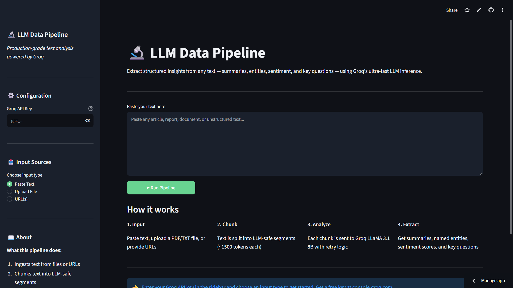

# 🔬 LLM Data Pipeline

[](https://python.org)
[](https://groq.com)
[](https://streamlit.io)
[](https://pandas.pydata.org)
[](#license)

A production-grade text analysis pipeline that ingests unstructured text from files or URLs, chunks it into LLM-safe segments, sends each chunk to Groq's LLM API for structured extraction, and returns summaries, named entities, sentiment scores, and key questions.

**Built without LangChain — direct Groq API calls with retry logic and exponential backoff.**

**🚀 Live App:** https://llm-data-pipeline.streamlit.app

---



---

## What it does

1. **Ingest** — reads `.txt` files, `.pdf` files, or fetches live URLs
2. **Chunk** — splits text into ~1,500 token segments using paragraph-first strategy
3. **Analyze** — sends each chunk to Groq LLaMA 3.3 70B with retry logic and exponential backoff
4. **Extract** — returns structured JSON with summary, entities, sentiment, and key questions
5. **Export** — download results as JSON

## Features

- **3 input modes** — paste text directly, upload a PDF/TXT file, or enter URLs
- **Retry logic** — Tenacity-based exponential backoff (4 attempts, 2s → 16s wait) on rate limits and timeouts
- **Robust JSON parsing** — 4 fallback strategies for extracting structured output from LLM responses
- **Graceful failure** — failed chunks are logged and skipped; pipeline never crashes mid-run
- **94.4% chunk success rate** in production testing across mixed input types
- **Dark theme UI** with metrics, entity tags, sentiment badges, and JSON download

## Tech Stack

- **LLM:** Groq API — `llama-3.3-70b-versatile`
- **UI:** Streamlit
- **Retry:** Tenacity
- **PDF extraction:** pypdf
- **URL scraping:** httpx + BeautifulSoup
- **Data:** Pandas, openpyxl

## Project Structure
```
llm-data-pipeline/
├── app.py                  ← Streamlit UI entry point
├── main.py                 ← CLI entry point (original pipeline)
├── src/
│   ├── ingestion.py        ← Reads .txt, .pdf files and fetches URLs
│   ├── preprocessor.py     ← Cleans text and chunks into LLM-safe sizes
│   ├── llm_client.py       ← Groq API calls with retry + JSON parsing
│   └── storage.py          ← Saves JSON, Excel, and text report
├── inputs/
│   └── sample.txt          ← Sample input for testing
├── outputs/
│   ├── sample_results.json
│   ├── sample_results.xlsx
│   └── sample_summary_report.txt
├── .streamlit/
│   └── config.toml         ← Dark theme config
├── requirements.txt
└── README.md
```

## Running Locally

```bash
git clone https://github.com/Rosesharma13/llm-data-pipeline.git
cd llm-data-pipeline
pip install -r requirements.txt
```

**Streamlit UI:**
```bash
streamlit run app.py
```

**CLI (original pipeline):**
```bash
export GROQ_API_KEY=your_key_here   # Windows: $env:GROQ_API_KEY="..."
python main.py --file inputs/sample.txt
python main.py --urls https://en.wikipedia.org/wiki/Artificial_intelligence
python main.py --file inputs/sample.txt --urls https://bbc.com/news
```

Get a free Groq API key at [console.groq.com](https://console.groq.com)

## Sample Output

```json
{
  "pipeline_run": "20260422_143022",
  "total_chunks": 2,
  "successful": 2,
  "failed": 0,
  "results": [
    {
      "source": "inputs/sample.txt",
      "summary": "AI is transforming healthcare through diagnostics and cost reduction...",
      "entities": {
        "people": ["Eric Topol", "Elizabeth Warren"],
        "organizations": ["Google DeepMind", "FDA", "Microsoft"],
        "places": ["San Diego", "Geneva", "London"]
      },
      "sentiment": {"label": "neutral", "confidence": 0.78},
      "questions": [
        "How can algorithmic bias in AI diagnostics be addressed?",
        "Will AI exacerbate healthcare inequalities?",
        "How should regulators balance innovation and patient safety?"
      ]
    }
  ]
}
```

## Design Decisions

**No LangChain** — direct Groq API calls keep the codebase transparent, dependency-free, and easier to debug. The pipeline has no hidden abstractions.

**Chunking strategy** — paragraphs first, sentences if needed. Keeps semantic units intact rather than splitting mid-thought.

**4-fallback JSON parsing** — LLMs occasionally wrap JSON in markdown or add trailing commas. The parser tries direct parse → markdown extraction → regex match → cleaned parse before failing.

**Fail-safe pipeline** — any single bad input (dead URL, corrupt PDF, API timeout) is logged and skipped. The pipeline always produces output for the inputs that worked.

## Known Limitations

- PDF extraction may lose formatting from scanned or complex PDFs
- Token estimation is character-based (~4 chars per token), not exact
- URLs requiring JavaScript rendering are not supported (static HTML only)
- Groq free tier rate limits may slow processing of large inputs

## License

MIT

## Author

**Rose Sharma**
[GitHub](https://github.com/Rosesharma13) · [LinkedIn](https://linkedin.com/in/rose-sharma13) · [Portfolio](https://rosesharma13.github.io)
